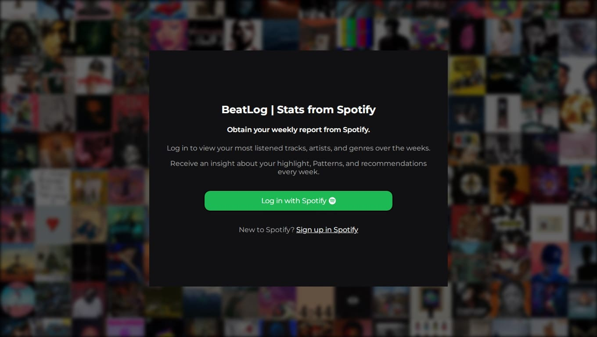
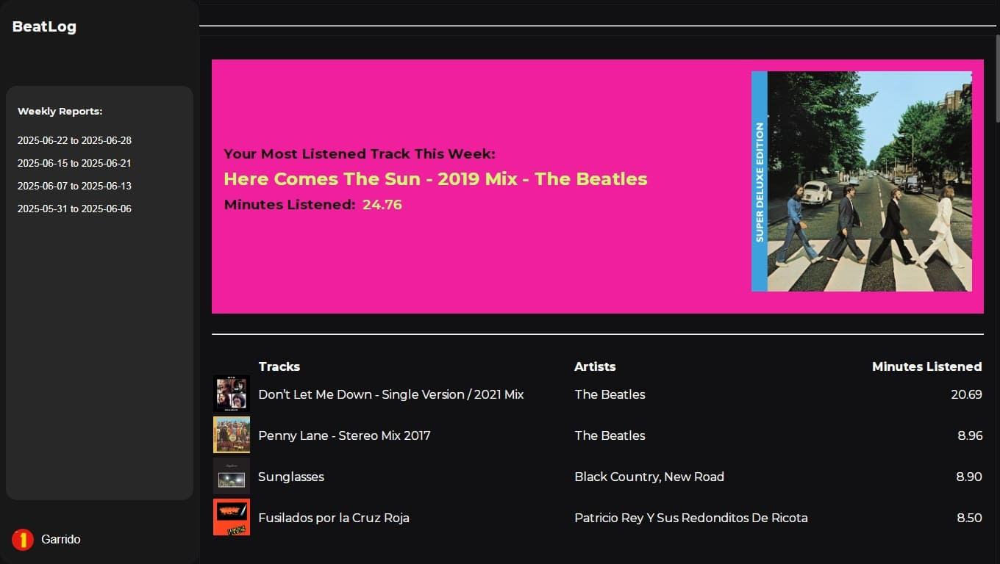
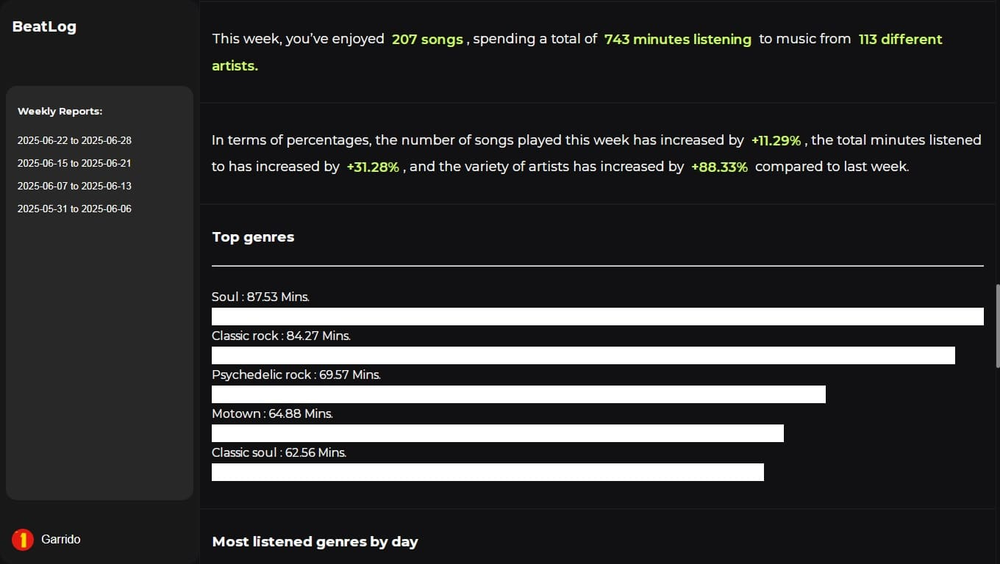

# Spotify Streaming Reports

## Overview
Python project that retrieves and reports a user's Spotify usage, weekly highlights, and patterns while generating personalized recommendations using AI.


## Table of Contents

- [About](#about)
- [Features](#features)
- [Installation](#installation)
- [Configuration](#configuration)
- [Usage](#usage)
- [Screenshots](#screenshots)
- [Contributing](#contributing)
- [License](#license)
## About

Spotify Streaming Reports is a Python-based tool that analyzes a user's listening history on Spotify and generates weekly summaries including:

- Listening time breakdown
- Most played artists, genres, and tracks
- Listening trends and variation over time
- Weekly personalized recommendations based on patterns

The project aims to provide insights into your listening habits and help you rediscover music you love.

Spotify Streaming Reports integrates DeepSeek (via OpenRouter) to generate personalized weekly highlights, observations, and music recommendations based on your listening data.

This project uses the model `deepseek/deepseek-r1:free`, which is accessed through the OpenRouter API. The AI analyzes your top genres, artists, and patterns to deliver meaningful insights beyond basic statistics.
## Features

- 🔁 Weekly summary of listening activity
- 📊 Genre and artist usage patterns
- 📈 Time-based trends and visualizations
- 🌟 Personalized recommendations.
- 🤖 AI-generated summaries and recommendations using DeepSeek via OpenRouter
- Developed a website that allows users to visualize each weekly report.
- 🧠 Built with Spotify Web API and Python data tools (pandas, etc)


## Installation

1. Clone the repository:
```bash
git clone https://github.com/Garridot/spotify-streaming-reports.git
```

2. Create a virtual environment:
```
python -m venv venv
source venv/bin/activate 
```

3. Install dependencies:
```
pip install -r requirements.txt
```


## Configuration

To use the Spotify API, you must register your application on the [Spotify Developer Dashboard](https://developer.spotify.com/dashboard/), and set the following environment variables:

```bash
SPOTIPY_CLIENT_ID=your_client_id
SPOTIPY_CLIENT_SECRET=your_client_secret
SPOTIPY_REDIRECT_URI=http://localhost:8000/callback
```

You must store them in a `.env` file.

You will need an OpenRouter API key to access DeepSeek models. You can get yours at [OpenRouter.ai](https://openrouter.ai/).


```bash
OPENROUTER_API_KEY=your_openrouter_api_key
```

Add the following to your `.env` file:


## Usage

Once you are authenticated, the website will gather your data for the week and provide you with a visual report.

Run:
```bash
python run.py
```
## Screenshots







## Contributing

Pull requests are welcome! For major changes, please open an issue first to discuss what you'd like to change.

Don't forget to update tests as appropriate.